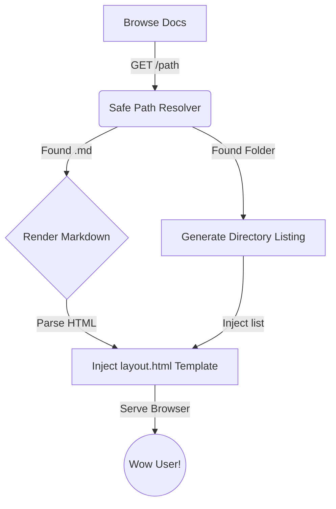

# 📝 Documentation Viewer

Self-hosted local documentation viewer. This service serves markdown files from a designated directory as a lightweight, reactive HTML site with instant reloads.

> [!NOTE]
> Any changes you made to the markdown files in the documentation directory will show up here immediately upon refreshing the page. No rebuild steps, no compilation delay.

---

## 🚀 Getting Started

To mount your project documentation, configure the following environment variables in your deployment setup:

1. **`DOCS_DOMAIN`**: The domain you want Traefik to route to this viewer (e.g. `docs.homelab.local`).
2. **`DOCS_PROJECT_PATH`**: The absolute path on your host machine pointing to your markdown files (e.g. `/home/kiskaadee/Projects/my-app/docs`).

For example, when using the repository's `appctl` CLI wrapper:
```bash
# Sourcing environment, appctl maps:
# DOCS_PROJECT_PATH -> PROJECT_PATH
./appctl up docs
```

---

## 🛠️ Features

Here is a breakdown of what this documentation server provides out-of-the-box:

### 1. Dynamic Routing
- `GET /` resolves to `README.md` or `index.md` at your documentation root.
- `GET /docs/infra` matches `docs/infra.md` or `docs/infra/README.md`.
- Clicking directories with no `README.md` serves an automatic, styled list of that folder's contents.

### 2. Search & Sidebar Navigation
- The sidebar dynamically scans the directories of your project workspace for `.md` files.
- You can filter documentation files instantly using the **Search** input at the top of the sidebar. It searches across names and URLs.

### 3. Sleek Themes (Light & Dark)
- Persisted theme settings using `localStorage`.
- Click the toggle button in the bottom-left corner of the sidebar to switch between a gorgeous dark slate mode and a clean light mode.

### 4. Code Highlight & Copy
- Code blocks are automatically highlighted with Prism.js.
- Hovering over a code block shows a **Copy** button to copy code instantly.

```python
# Test Python block
def hello_world():
    print("Welcome to your local docs!")
    return True
```

### 5. Mermaid.js Support
You can render flowcharts, sequence diagrams, and class diagrams directly inside your markdown pages using standard fenced code blocks labeled `mermaid`.



### 6. Alert Callouts
Use standard GitHub alert formatting to highlight notices:

> [!TIP]
> Use callout boxes to highlight important tips, warnings, or caution sections. They render with custom icons and borders.
